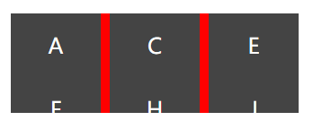
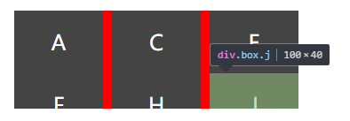
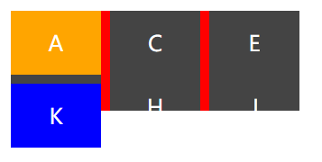
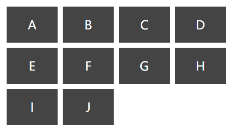
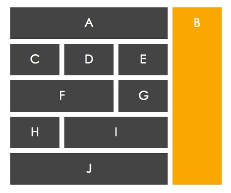

本文我们要说的主角便是 _CSS_ 的新成员: `grid-layout`。  
由于其兼容性的问题，网上这方面的中文资料并不是很多。就算有，很多内容翻译得也是很不通顺，所以就想借这个学习的机会好好整理一下。  
注：以下 `gird` 译为 ‘网格’。
### 兼容性
说到兼容性，截止到 `2017-04-15`，全球只有 30% 左右的浏览器支持这套布局体系，移动端更是惨不忍睹。也就是说目前只有在 chrome、firefox 这类走在前沿的浏览器中，我们才能使用它。  
虽然兼容性是很差，但是我们也不能对这个新特性视而不见啊。未来触手可及，也就再等个三五年吧: )  

### Grid Layout 到底是什么
众所周知，_CSS_ 的发布已经逐渐的模块化，而 `grid-layout` 就是其中的一个用于布局的模块。  
以前我们是怎么完成日常的布局工作的呢？没错，从最早的 `table` 布局到后来所谓的 `CSS + DIV`（其实就是利用 `display, position, float` 等布局属性），再到现在的 `flexbox`，前端开发人员完成布局的手段可以说是越加多样化，完成同样一个布局所需要的代码也越来越少或者说越来越具有可读性。举例来说，以前实现起来很费事并且还不完美的‘垂直居中’，现在只需寥寥两句 `display:flex;align-items:center;` 就可以了。  
那么 `grid-layout` 给我们带来了什么呢，我认为是及其具有灵活性的布局方案。`flexbox` 已经给我们提供了很多的便利，但是我们只能完成元素在一个方向上的排布（要么是 `row` 要么是 `column`）。`grid-layout` 赋予了我们这样一种能力：同时指定两个方向上的布局细节。如果说 `flexbox` 是一维的，`grid-layout` 就是二维的。  

### 术语
下面是一些最基本的术语，看图就可以了。
###### 网格线
网格线分为行网格线（横向）和列网格线（纵向），下图红色的线就是所有列网格线中的第二条。  

  

###### 网格轨道
网格轨道就是网格线之间的部分。  

  

###### 网格单元格
下图红色的单元格，由第 2、3 条行线和第 2、3 条列线包围而成。

  

###### 网格区域
下图红色的区域，由第 1、3 条行线和第 2、4 条列线包围而成。  

  

###### 网格容器
如同 `flexbox`，只要设置 `display:grid | inline-grid;` 即可将元素设置为网格容器。  
不仅如此， 与`flexbox` 一样，`grid-layout` 也会使部分属性失效：
```css
/*
column-*
float, clear
vertical-align
::first-line ::first-letter
*/
```
### 单元格布局
由以上介绍的概念，我们可以得知，网格布局其实就是把页面分割成一个个类似 _Excel_ 单元格的东西。单元格布局是指，将网格容器内的元素‘放’到单元格中。  
那么首先我们就要声明一个网格容器并且设置行列的‘模板’。一起来看一个例子。  

###### EXAMPLE 1
*html*
```html
<div class="wrapper">
  <div class="box a">A</div>
  <div class="box b">B</div>
  <div class="box c">C</div>
  <div class="box d">D</div>
  <div class="box e">E</div>
  <div class="box f">F</div>
  <div class="box g">G</div>
  <div class="box h">H</div>
  <div class="box i">I</div>
  <div class="box j">J</div>
</div>
```
*css*
```css
.wrapper {
  display: grid;
  grid-template-columns: 100px 10px 100px 10px 100px;
  grid-template-rows: auto 10px auto;
}
.box {
  text-align: center;
  background: #444;
  color: #fff;
  font-size: 150%;
  padding: 20px;
}
.b, .d, .g, .i {
  background: red;
}
```
*output*  

  

  

相信第一次看到这个结果的同学，一定会说 `WTF` 这样的话。我们来分析一下，为什么是这样的效果。  
首先 `display:grid` 将 `.wrapper` 声明为一个网格容器，并且通过 `grid-template-rows` 和 `grip-template-columns` 属性设置了行列的‘模板’。这里我把 `100px 10px 100px 10px 100px` 和 `auto 10px auto` 叫做‘模板’，原因有二：首先，属性名里有个 `template`；其次，模板的意思是根据它能够批量生产，这里批量生产的东西就是单元格。行模板和列模板其实就是规定了有多少行多少列以及每一行和每一列的宽度是多少，这与上文中提到的‘网格轨道’的定义一致。  
我们从效果图中可以看出，每一行都是由 5 个单元格组成的。其实字母 B D G I 就藏在红色的单元格里，只是宽度不够没有显示出来。就如‘模板’中所设置的，每一行由 5 个单元格构成，各个单元格的宽度为 `100px` 和 `10px` 交替。  
再说第二行的高度为什么是 `40px`，行模板中设置的高度应该是 `10px`，但是由于 `padding:20px` 将高度撑开，也就造成了这样的结果。  
机智的小伙伴们马上发现了这个解释的漏洞：如果第二行的高度可以由 `padding` 撑开，那么第二列的宽度也应该能够被 `padding` 撑开才对啊。  
事实上，通过 _chrome_ 的调试工具我们发现，第二列的宽度确实是 `40px`，只不过只有 `10px` 显示了出来，剩余的部分藏在了相邻元素的后面。而第二行由于没有第三行遮挡，就表现为 `40px`。  
看下图，我在下面又加了个 K，并用不同的背景色标识，大家应该能清楚地看到第三行对第二行的遮挡。  
  

综上，可以明白这样一件事：划分出来的单元格只是一个个框框，我们可以把任意元素放到框框里，并且后面的框框会遮挡前面的框框。如果我们没有指定元素的大小（即 `auto`），它就会去自适应框框的大小，也就是填满这个框框。  

###### EXAMPLE 2
在上面的例子中，我们并没有手动地去将元素一个个放到框框里，而是撒手不管，让它们自己对号入座。实际的使用场景中，我们很有可能需要根据需求调整元素的位置，也就是说，我们要亲手将元素放到一些框框里。看接下来这个例子吧。  

*html*
```html
<div class="wrapper">
  <div class="box a">A</div>
  <div class="box b">B</div>
  <div class="box c">C</div>
  <div class="box d">D</div>
  <div class="box e">E</div>
  <div class="box f">F</div>
  <div class="box g">G</div>
  <div class="box h">H</div>
  <div class="box i">I</div>
  <div class="box j">J</div>
</div>
```
*css*
```css
.wrapper {
  display: grid;
  grid-template-columns: 100px 10px 100px 10px 100px 10px 100px;
  grid-template-rows: auto 10px auto 10px auto;
}
.box {
  text-align: center;
  background: #444;
  color: #fff;
  font-size: 150%;
  padding: 20px;
}
.a {
  grid-column-start: 1;
  grid-column-end: 2;
  grid-row-start: 1;
  grid-row-end: 2;
}
.b {
  grid-column-start: 3;
  grid-column-end: 4;
  grid-row-start: 1;
  grid-row-end: 2;
}
.c {
  grid-column-start: 5;
  grid-column-end: 6;
  grid-row-start: 1;
  grid-row-end: 2;
}
.d {
  grid-column-start: 7;
  grid-column-end: 8;
  grid-row-start: 1;
  grid-row-end: 2;
}
.e {
  grid-column-start: 1;
  grid-column-end: 2;
  grid-row-start: 3;
  grid-row-end: 4;
}
.f {
  grid-column-start: 3;
  grid-column-end: 4;
  grid-row-start: 3;
  grid-row-end: 4;
}
.g {
  grid-column-start: 5;
  grid-column-end: 6;
  grid-row-start: 3;
  grid-row-end: 4;
}
.h {
  grid-column-start: 7;
  grid-column-end: 8;
  grid-row-start: 3;
  grid-row-end: 4;
}
.i {
  grid-column-start: 1;
  grid-column-end: 2;
  grid-row-start: 5;
  grid-row-end: 6;
}
.j {
  grid-column-start: 3;
  grid-column-end: 4;
  grid-row-start: 5;
  grid-row-end: 6;
}
```
*output*  

  

也就是说我们可以通过之前介绍过的网格线来将元素限制在一个单元格里。通过 `grid-column-end, grid-column-start, grid-row-end, grid-row-start` 四个属性就能够完成。但这么写未免太啰嗦了，我们还有一个简写的形式：  
```css
.a {
  grid-column: 1 / 2;
  grid-row: 1 / 2;
}
```
简单说就是：起始行（列）线 / 终止行（列）线。  

###### EXAMPLE 3
我们通过网格线能够围出一个单元格，当然也能围出一片单元格区域，从而把元素放置在这个区域内。通过 `grid-area` 属性我们就能指定一块区域，语法格式如下。  
>grid-area: 区域行起始线 / 区域列起始线 / 区域行终止线 / 区域列终止线


既然能够指定区域，区域又有大有小，最小的区域也就是单元格，那么我们当然也可以用这个属性来完成上面的 EXAMPLE 2。  

*css*
```css
.wrapper {
  display: grid;
  grid-template-columns: 100px 10px 100px 10px 100px 10px 100px;
  grid-template-rows: auto 10px auto 10px auto;
}
.box {
  text-align: center;
  background: #444;
  color: #fff;
  font-size: 150%;
  padding: 20px;
}
.a {
  grid-area: 1 / 1 / 2 / 2;
}
.b {
  grid-area: 1 / 3 / 2 / 4;
}
.c {
  grid-area: 1 / 5 / 2 / 6;
}
.d {
  grid-area: 1 / 7 / 2 / 8;
}
.e {
  grid-area: 3 / 1 / 4 / 2;
}
.f {
  grid-area: 3 / 3 / 4 / 4;
}
.g {
  grid-area: 3 / 5 / 4 / 6;
}
.h {
  grid-area: 3 / 7 / 4 / 8;
}
.i {
  grid-area: 5 / 1 / 6 / 2;
}
.j {
  grid-area: 5 / 3 / 6 / 4;
}
```

### 合并单元格布局（区域布局）
这一节，我们将学习如何完成下图的布局：  

  

其实很简单，我们能够围出一个单元格，就能围出一片单元格区域。

###### METHOD 1

*html*
```html
<div class="wrapper">
  <div class="box a">A</div>
  <div class="box b">B</div>
  <div class="box c">C</div>
  <div class="box d">D</div>
  <div class="box e">E</div>
  <div class="box f">F</div>
  <div class="box g">G</div>
  <div class="box h">H</div>
  <div class="box i">I</div>
  <div class="box j">J</div>
</div>
```
*css*
```css
.wrapper {
  display: grid;
  grid-template-columns: 100px 10px 100px 10px 100px 10px 100px;
  grid-template-rows: auto 10px auto 10px auto 10px auto 10px auto;
}
.box {
  text-align: center;
  background: #444;
  color: #fff;
  font-size: 150%;
  padding: 20px;
  box-sizing: content-box;
}
.a {
  grid-column: 1 / 6;
  grid-row: 1 / 2;
}
.b {
  grid-column: 7 / 8;
  grid-row: 1 / 10;
  background: orange;
}
.c {
  grid-column: 1 / 2;
  grid-row: 3 / 4;
}
.d {
  grid-column: 3 / 4;
  grid-row: 3 / 4;
}
.e {
  grid-column: 5 / 6;
  grid-row: 3 / 4;
}
.f {
  grid-column: 1 / 4;
  grid-row: 5 / 6;
}
.g {
  grid-column: 5 / 6;
  grid-row: 5 / 6;
}
.h {
  grid-column: 1 / 2;
  grid-row: 7 / 8;
}
.i {
  grid-column: 3 / 6;
  grid-row: 7 / 8;
}
.j {
  grid-column: 1 / 6;
  grid-row: 9 / 10;
}
```

好的，我们成功完成了这个布局。是不是很简单？这里我们再介绍一个叫做 `span` 的关键字，它有跨越的意思。也就是说，我们可以这样重写上面的例子：
```css
.a {
  grid-column: 1 / span 5;
  grid-row: 1 / span 1;
}
.b {
  grid-column: 7 / span 1;
  grid-row: 1 / span 9;
}
/* 如果只跨一行或者一列，可以直接省略终止线 */
.a {
  grid-column: 1 / span 5;
  grid-row: 1;
}
.b {
  grid-column: 7;
  grid-row: 1 / span 9;
}
```

### METHOD 2

我们还可以通过 `grid-area` 来完成上面的工作。

*css*
```css
.wrapper {
  display: grid;
  grid-template-columns: 100px 10px 100px 10px 100px 10px 100px;
  grid-template-rows: auto 10px auto 10px auto 10px auto 10px auto;
}
.box {
  text-align: center;
  background: #444;
  color: #fff;
  font-size: 150%;
  padding: 20px;
  box-sizing: content-box;
}
.a {
  grid-area: 1 / 1 / 6 / 2;
}
.b {
  grid-area: 7 / 1 / 8 / 10;
}
.c {
  grid-area: 3 / 1 / 4 / 2;
}
.d {
  grid-area: 3 / 3 / 4 / 4;
}
.e {
  grid-area: 3 / 5 / 4 / 6;
}
.f {
  grid-area: 5 / 1 / 6 / 4;
}
.g {
  grid-area: 5 / 5 / 6 / 6;
}
.h {
  grid-area: 7 / 1 / 8 / 2;
}
.i {
  grid-area: 7 / 3 / 8 / 6;
}
.j {
  grid-area: 9 / 1 / 10 / 6;
}
```

### METHOD 3

我们还可以对行线和列线进行自定义命名，就像这样：  

*css*
```css
.wrapper {
  display: grid;
  grid-template-columns: repeat(3, [column] 100px [gutter] 10px) [column] 100px [gutter];
  grid-template-rows: repeat(4, [row] auto [gutter] 10px) [row] auto [gutter];
}
.box {
  text-align: center;
  background: #444;
  color: #fff;
  font-size: 150%;
  padding: 20px;
  box-sizing: content-box;
}
.a {
  grid-column: column / gutter 3;
}
.b {
  grid-column: column 4;
  grid-row: row / gutter 5;
  background: orange;
}
.c {
  grid-row: row 2;
}
.d {
  grid-column: column 2;
  grid-row: row 2;
}
.e {
  grid-column: column 3;
  grid-row: row 2;
}
.f {
  grid-column: column / gutter 2;
  grid-row: row 3;
}
.g {
  grid-column: column 3;
  grid-row: row 3;
}
.h {
  grid-row: row 4;
}
.i {
  grid-column: column 2 / span gutter 2;
  grid-row: row 4;
}
.j {
  grid-column: column / gutter 3;
  grid-row: row 5;
}
```

这其中有很多小技巧：  
- 定义行列模板的时候，在每一条轨道之间增加了行线和列线的自定义命名，用 `[]` 包裹起来。这个命名有什么用处呢？我们可以在 `grid-column` 和 `grid-row` 中通过这些名称引用那些行线和列线。我们还看到，自定义的命名是可以重复的，但这样的话如果像 `grid-column: column / column` 这样写，解释器根本就不会知道你指的是哪条线，于是我们可以通过在名称后面追加一个数字来指定我们具体是想引用哪条线。举个例子：`grid-column: column 1 / gutter 3` 就是说列起始线是第一条 column 线，列终止线是第三条 gutter 线，基本上数字 1 都是可以被省略掉的，于是可以写成 `grid-column: column / gutter 3`。之前提过 span 这个关键字，这里我们还可以写成 `grid-column: column / span gutter 3`，好吧这里并没有体现出 span 应有的风姿，下面这个改写的例子或许更能够让你接受：
```css
grid-column: column 2 / gutter 4;
/*改写如下*/
grid-column: column 2 / span gutter 3;
```
- 定义行列模板的时候，我们使用了 repeat 函数，这个函数接受两个参数，第一个是重复的次数，第二个是要重复的字符串。  


### 其他有用的属性

好了，经过上面的讨论，大家应该能够对这个 `grid-layout` 有初步的了解啦。下面列一下其他有用的属性。  

- grid-gap 系列
  + grid-column-gap 列之间的间隙呗
  + grid-row-gap 行之间的间隙
  + grid-gap 格式：行间隙 / 列间隙
- grid-auto 系列
  + grid-auto-columns 定义溢出的列的宽度
  + grid-auto-rows 定义溢出的行的高度
  + grid-auto-flow 设置元素的排列方式 row | column | row dense | column dense
- 对齐系列
  + justify-items 定义单元格内容的对齐方式 - 横向 start | end | center | stretch(default)
  + align-items 定义单元格内容的对齐方式 - 纵向 start | end | center | stretch(default)
  + justify-content 定义单元格整体的对齐方式 - 横向 start(default) | end | stretch | space-around | space-between | space-evenly
  + align-content 定义单元格整体的对齐方式 - 纵向 start(default) | end | stretch | space-around | space-between | space-evenly
  + justify-self / align-self 在 grid 子项中定义，可以单独调整该子项的对齐方式

有兴趣的同学，自己写个 demo 尝试一下也就知道这些属性是干什么的了。这里简单用图说明一下 `space-around space-evenly space-between` 这三个值。

*space-around*
  

*space-evenly*
  

*space-between*
  
